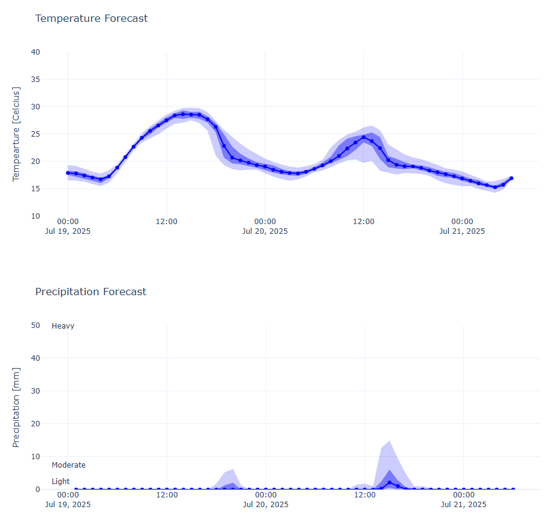

# Chaocast
Chaocast is a weather unceratinty visualization app.

## Overview
Chaocast leverages Python, XArray and Dash to provide interactive visualizations of weather forecast uncertainty using ensemble data from the KNMI HARMONIE Cy43 model. The goal is to help users explore and understand the range of possible weather outcomes at specific locations, supporting better decision-making in the face of meteorological uncertainty.

Visit the [KNMI](https://www.knmidata.nl/open-data/harmonie#:~:text=KNMI%20gebruikt%20en%20mede-ontwikkelt,hoge%20resolutie%20op%20korte%20afstanden.) site for more information on ensemble forecasts.


<figure>

  <figcaption>Temperature and Precipitaition Percentile Confidence Interval plot. Light blue: 90% confidence, 9/10 members. Dark blue = 50% confidence, 5/10 members. Dotted line: Median Forecast.</figcaption>
</figure>


## Getting Started
### Setup
1. **Clone the repository:**
   ```
   git clone https://github.com/menthoven/chaocast.git
   cd chaocast
   ```

2. **Get an API KEY**
    - See [here](https://developer.dataplatform.knmi.nl/open-data-api) for the KNMI developer portal to get an API key
    

2. **Set up environment variables:**
   - Create a `.env` file in the project root.
   - Add your API key:
     ```
     API_KEY=your_api_key_here
     ```

### Running with Docker
1. **Build the image and start the docker container**
   ```
   docker compose up --build
   ```

2. **Wait for approximately 20 minutes to finish downloading and preprocessing**
    - The app will download approximately 12GB of forecasts to the local `./data` folder
    - All files will be unpacked and preprocessed into a single NetCDF file. 

> [!WARNING] 
> Local testing showed that peak memory usage can exceed 18GB. Consider increasing Docker memory limits if you're running into issues.


3. **Access the dashboard:**
   - Open your browser and go to [http://localhost:8050](http://localhost:8050)
   - Click on any location on the map to visualize the uncertainty in weather forecasts.